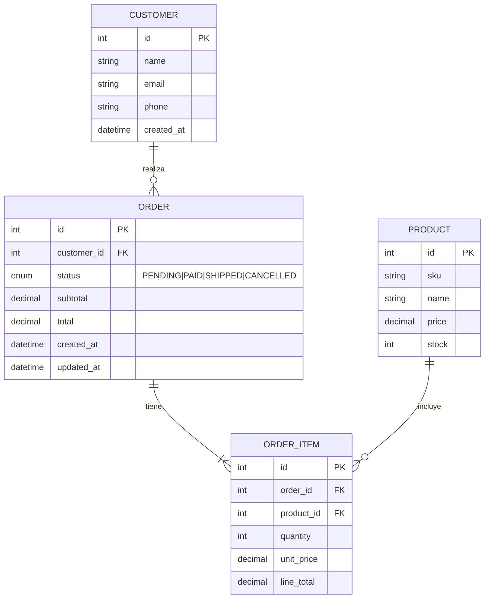

# 🧰 Backend & Data Portfolio 2025 — Orders & Inventory API

[](https://www.python.org/)
[](https://www.djangoproject.com/)
[](https://www.django-rest-framework.org/)
[](https://mariadb.org/)
[](https://powerbi.microsoft.com/)
[](LICENSE)

**Objetivo:** construir un portafolio profesional combinando **Backend (Django/DRF + MariaDB)** y **Datos (ETL con Pandas + Power BI)**.  
Este repo contiene el **Proyecto 1 — Orders & Inventory API** y, más adelante, se integrará con el **Proyecto 2 — FruitOps Data Pipeline**.

---

## 👩‍💼 Para RR.HH. (resumen ejecutivo)
- 🔧 **API REST** con creación de órdenes, items anidados y validación de **stock**.
- 🔐 Preparado para **JWT** y permisos por rol (se agrega en Semanas 2–3).
- ✅ **Pruebas** automatizadas y **CI/CD** (a configurar en Semanas 3 y 8).
- 🧾 **Documentación** clara (este README) + ejemplos con cURL/Postman.
- 📊 Integración con **Power BI** (semana 6) para métricas de negocio.
- 🚀 Despliegue público (semana 8) y post de avances en LinkedIn.

---

## 👨‍💻 Para desarrolladores (inicio rápido)

### Requisitos
- Python 3.12+/3.13
- DB en Docker (recomendado) o MariaDB instalado local
- Pip y venv

### 1) Clonar y preparar entorno
```bash
git clone https://github.com/<tu_usuario>/backend-data-portfolio-2025.git
cd backend-data-portfolio-2025/orders_inventory_api
python -m venv .venv
# Windows PowerShell
.\.venv\Scripts\Activate.ps1
python -m pip install --upgrade pip
pip install -r requirements.txt   # o: pip install django djangorestframework mysqlclient python-dotenv
```

> Si `mysqlclient` falla en Windows, usa **PyMySQL**: `pip install pymysql` y en orders_inventory_api/config/__init__.py agrega:
> ```python
> import pymysql
> pymysql.install_as_MySQLdb()
> ```

### 2) Base de Datos
Opción A — Docker (recomendada)

# desde la raíz del repo
cd C:\backend-data-portfolio-2025
docker compose --env-file .env.db up -d
# Adminer: http://localhost:8080  (Servidor: db | Usuario: app | Clave: app | DB: portfolio)


Opción B — Local

MariaDB corriendo en 127.0.0.1:3306 con usuario app/app y DB portfolio.

### 3) Variables de entorno(Django)
Crea orders_inventory_api/.env:

SECRET_KEY=dev-secret
DB_HOST=127.0.0.1
DB_PORT=3307        # 3307 si usas Docker (mapeado); 3306 si es instalación local
DB_NAME=portfolio
DB_USER=app
DB_PASS=app

### 4) Migraciones, seeds y runserver
cd backend-data-portfolio-2025/orders_inventory_api
python manage.py migrate
# (opcional) productos de ejemplo
python manage.py loaddata ../seeds/products_fixture.json
python manage.py runserver


- Admin: http://127.0.0.1:8000/admin

- API (próximo paso Sem. 2): http://127.0.0.1:8000/api/

## 🧱 Modelo de datos (Proyecto 1)


## Notas (coinciden con el código)

- ORDER_ITEM: quantity > 0 y unique_together (order_id, product_id).

- ORDER: recalcula subtotal y total después de guardar los ítems.

- En Docker: la app conecta a 127.0.0.1:3307; Adminer usa host db.
---

## 🔌 Endpoints principales (DRF)

- `GET /api/products/` — lista de productos (búsqueda por `sku` o `name`).
- `POST /api/customers/` — crea cliente.
- `POST /api/orders/` — crea orden con items anidados.

**Crear cliente**
```http
POST /api/customers/
Content-Type: application/json

{
  "name": "Cliente Demo",
  "email": "cliente.demo@example.com",
  "phone": "+56 9 1234 5678"
}
```

**Crear orden** (descuenta stock y calcula totales)
```http
POST /api/orders/
Content-Type: application/json

{
  "customer": 1,
  "items": [
    {"product": 1, "quantity": 2},
    {"product": 3, "quantity": 1, "unit_price": 3500}
  ]
}
```

Respuesta (ejemplo):
```json
{
  "id": 12,
  "customer": 1,
  "status": "PENDING",
  "subtotal": "9470.00",
  "total": "9470.00",
  "created_at": "2025-08-18T14:32:01Z",
  "items_detail": [
    {"id": 21, "product": {"id": 1, "sku":"ALM-CAF-500","name":"Café molido 500 g","price":"3990.00","stock":78}, "quantity": 2, "unit_price": "3990.00", "line_total": "7980.00"},
    {"id": 22, "product": {"id": 3, "sku":"ALI-AZU-1K","name":"Azúcar blanca 1 kg","price":"1490.00","stock":94}, "quantity": 1, "unit_price": "3500.00", "line_total": "3500.00"}
  ]
}
```

---

## 🗂️ Estructura del repo
```
backend-data-portfolio-2025/
├─ orders_inventory_api/        ← Proyecto 1 (Django + DRF + MariaDB)
│  ├─ config/                   ← settings/urls
│  ├─ core/                     ← modelos, serializers, views
│  ├─ manage.py
│  └─ .env.example (sugerido)
├─ fruitops_pipeline/           ← Proyecto 2 (ETL + Power BI) — Semanas 5–7
├─ dashboards/                  ← Power BI .pbix
├─ seeds/                       ← datos de ejemplo (fixtures/CSV)
│  └─ products_fixture.json
└─ docs/                        ← bitácora y diagramas
```

---

## 📦 Seeds incluidos
- `seeds/products_fixture.json` — 20 productos en español (SKU, nombre, precio, stock).
```bash
python manage.py loaddata ../seeds/products_fixture.json
```

> Para datos de la **Semana 5 (FruitOps)**, se usarán CSV simulados con: `orchards`, `harvests`, `batches`, `sensors`, `defects`, `shipments`. (Se documentará en `/fruitops_pipeline` al avanzar).

---

## 🧭 Roadmap (10 semanas)
- [x]  Semana 1 (en curso): Setup + DB en Docker + Admin con órdenes e ítems + seeds + docs
          - [x]  Monorepo y modelo Product
          - [x]  MariaDB + Adminer con Docker; conexión desde Django
          - [x]  Order + OrderItem en admin (precio auto y line_total calculado)
          - [x]  Seeds de productos
          - [ ]  Documentación final S1 + capturas + mini demo (viernes)
- [ ] Semana 2: CRUD DRF (/api/products read-only, /api/customers, /api/orders con ítems anidados), búsqueda/paginación, JWT básico, Swagger
- [ ] Semana 3: Tests (pytest/coverage), manejo de errores, select_related/prefetch_related, índices y EXPLAIN
- [ ] Semana 4: Tareas asíncronas (Celery), exportación CSV, correo
- [ ] Semana 5: ETL (Pandas) con datos simulados → MySQL
- [ ] Semana 6: Esquema estrella + Dashboard Power BI
- [ ] Semana 7: Orquestación + API de KPIs
- [ ] Semana 8: Docker + CI/CD + Deploy público
- [ ] Semana 9: Documentación completa + métricas
---

## 🤝 Contribuir
- Commits con **Conventional Commits** (`feat:`, `fix:`, `chore:`, `docs:`…).  
- Issues/PRs con descripción clara y pasos para reproducir.

---

## 📄 Licencia
MIT. Libre para uso educativo y demostrativo.

---

## 📬 Contacto
**Diego Gárate** — *Open to Work (Backend Jr & Trainee de Datos)*  
LinkedIn: https://www.linkedin.com/in/diegogarate/  
Email: garatediego.1@gmail.com
