# Diario — Semana 2 _(25–29 ago 2025)_

> Ritmo: **4 mañanas/semana** (L–M backend, X–V datos)  
> Zona horaria: **America/Santiago**

---

## Estado general de la semana

- [x] **Día 1 (Lun 25/08):** Integración de Swagger/OpenAPI (drf-spectacular). — **completado**
- [x] **Día 2 (Mar 26/08):** Generar colección Postman desde OpenAPI. **completado**
- [x] **Día 3 (Mié 27/08):** JWT básico y pruebas de login/logout. **completado**
- [x] **Día 4 (Vie 29/08):** Permisos por rol + afinación de filtros/paginación. **completado**
---
## Pendientes de la Semana 2
- [x] Generar y versionar colección Postman.
- [x] Implementar JWT básico.
- [x] Configurar permisos por rol.
- [x] Afinar filtros y paginación de endpoints.
---

## Día 1 — Lunes 25 ago 2025

### 🎯 Objetivo del día
- Integrar **Swagger/OpenAPI** en el proyecto con `drf-spectacular`.
- Exponer documentación automática en `/api/docs` y `/api/redoc`.

### ✅ Lo conseguido
- Instalación de `drf-spectacular` y `drf-spectacular-sidecar`.
- Configuración en `settings.py`:
  - Corregido `DEFAULT_SCHEMA_CLASS` duplicado.
  - Añadido toggle `DOCS_PUBLIC` para definir acceso público o protegido.
- Configuración en `urls.py`:
  - `/api/schema/` → Esquema OpenAPI (JSON/YAML).
  - `/api/docs/` → Swagger UI.
  - `/api/redoc/` → Redoc.
- Ajustes en serializers:
  - `OrderSerializer.get_items_detail` anotado con `@extend_schema_field` para describir salida correctamente.
  - `OrderItemWriteSerializer.validate_quantity` corregido (ahora fuera de `Meta`).
- Verificación:
  - `/api/schema/?format=json` exporta el esquema.
  - `/api/docs/` y `/api/redoc/` muestran documentación navegable sin errores.
  - Warning de `get_items_detail` resuelto.

### 🧪 Evidencia rápida (comandos)
```powershell
# Instalar librerías
pip install drf-spectacular drf-spectacular-sidecar

# Levantar server
cd orders_inventory_api
.\.venv\Scripts\Activate.ps1
python manage.py runserver

# Probar esquema y docs
#  - http://127.0.0.1:8000/api/schema/?format=json
#  - http://127.0.0.1:8000/api/docs/
#  - http://127.0.0.1:8000/api/redoc/
```
### Capturas guardadas
- **01-swagger.png**
  
- **02-redoc.png** 
  

📸 Ver carpeta completa → [docs/capturas/semana2/](../docs/capturas/semana2/dia1/)

### 🧱 Bloqueos y soluciones
- **Error:** `Incompatible AutoSchema used on View CustomerViewSet`.  
  **Solución:** había dos bloques `REST_FRAMEWORK`, se fusionaron en uno con `DEFAULT_SCHEMA_CLASS`.
- **Error:** `ImportError: rest_framework.permissions.ISAutenticated`.  
  **Solución:** corregido el typo → `IsAuthenticated`.
- **404 en /api/docs:** se debía a una coma extra en la ruta (`'api/docs/,'`).  
  **Solución:** corregido a `'api/docs/'`.
- **Warning en get_items_detail:** se añadió `@extend_schema_field(OrderItemReadSerializer(many=True))`.

### ▶️ Próximos pasos (para el Día 2)
- Exportar esquema OpenAPI en JSON.
- Importar en Postman para generar colección automáticamente.
- Versionar la colección en `docs/postman_collection.json`.

---
## Día 2 — Martes 26 ago 2025

### 🎯 Objetivo del día
- Generar y validar **colección Postman** desde OpenAPI.
- Probar **CRUD completo de Customers**.
- Documentar con **Examples** en la colección (200, 201, 204).

### ✅ Lo conseguido
- Requests creados en la colección:
  - `GET /api/customers/` → Example: **200 customers list**
  - `POST /api/customers/` → Example: **201 customer created**
  - `GET /api/customers/{id}/` → Example: **200 customer detail**
  - `DELETE /api/customers/{id}/` → Example: **204 no content**
- Tests Postman agregados en cada request (status codes, estructura JSON, variables env).
- Colección exportada a `docs/postman_collection.json`.

### 🧪 Evidencia rápida
- Ejecución de tests en verde (201 Created, 200 OK, 204 No Content).
- Variables de entorno (`customer_id`) gestionadas automáticamente.
- Examples visibles en la colección.

### Capturas guardadas
- **01-postman-get-customers.png** 
  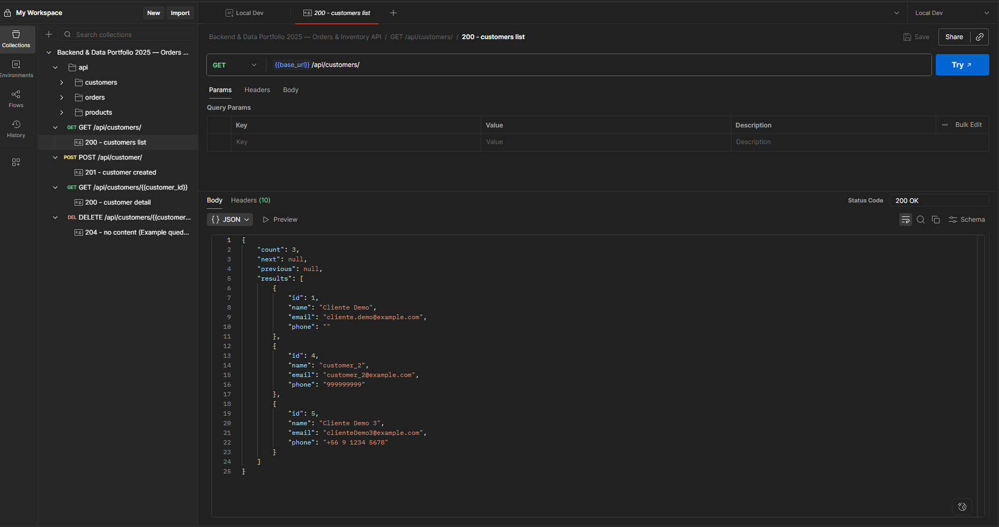
- **02-postman-post-customer.png** 
  
- **03-postman-get-customer-detail.png** 
  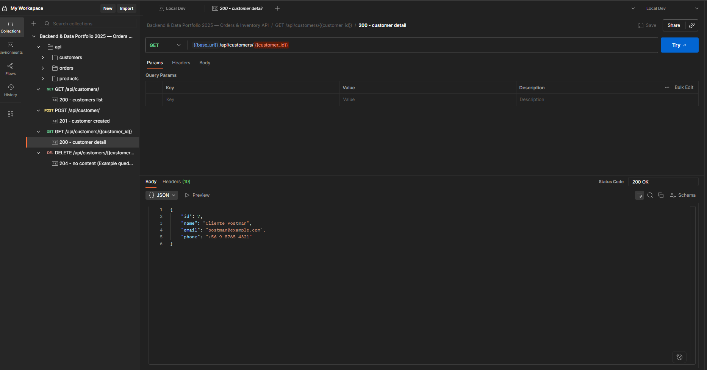
- **04-postman-delete-customer.png**
  
- **01-postman-examples.png**
  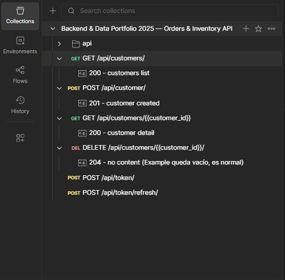

📸 Ver carpeta completa → [docs/capturas/semana2/dia2/](./capturas/semana2/dia2/)


### ▶️ Próximos pasos (Día 3)
- Implementar **JWT básico** con `djangorestframework-simplejwt`.
- Agregar endpoints `/api/token/` y `/api/token/refresh/`.
- Integrar tokens en Postman (env var `token`) y extender tests.

---

### 📅 Día 3 — Mié 27/08/2025  ###
**Tema:** JWT básico + autenticación en Swagger/Postman  

### 🔑 Objetivos
- Configurar **JWT (SimpleJWT)** con endpoints `/api/token/`, `/api/token/refresh/`, `/api/token/verify/`.
- Probar autenticación en **Swagger** (candado Authorize).
- Probar autenticación en **Postman** (access/refresh token).
- Implementar **refresh automático** ante 401 en Postman.

---

### ✅ Evidencia ### Capturas

1. **Swagger — popup Authorize**  
   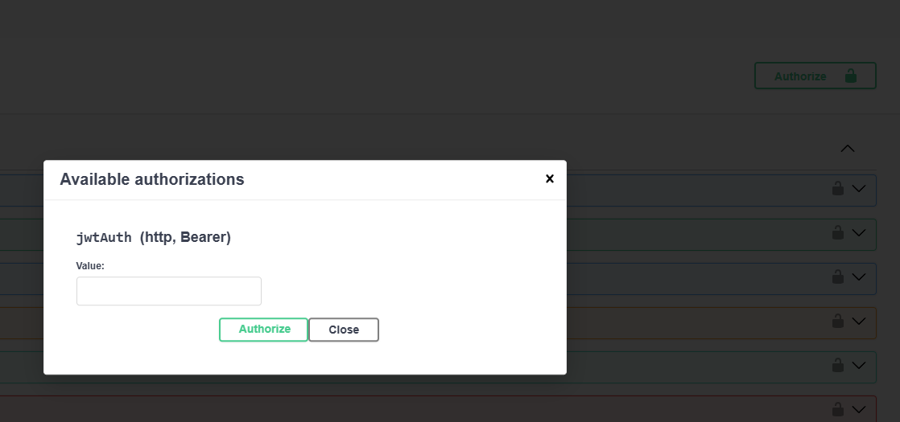

2. **Swagger — endpoint autenticado con token (200 OK)**  
   

3. **Postman — /api/token/ (access + refresh generados)**  
   

4. **Postman — Header Authorization con Bearer {{access_token}}**  
   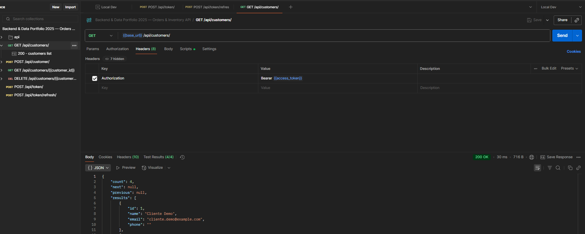

5. **Postman — /api/token/refresh/ (nuevo access)**  
   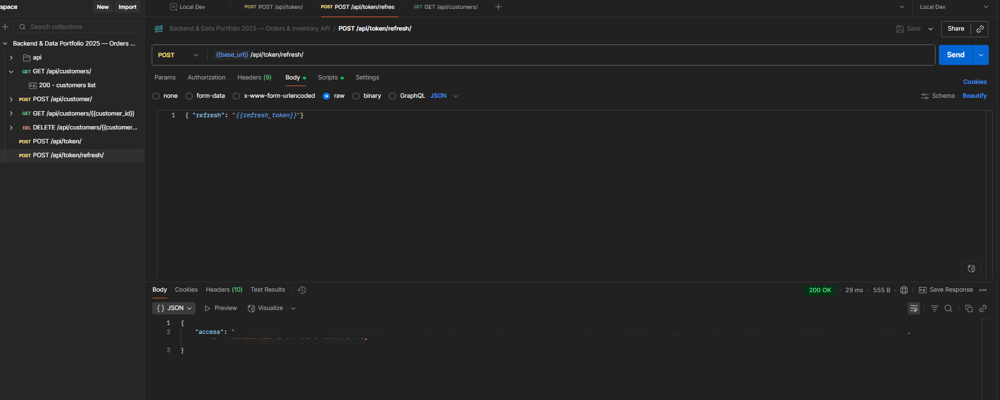  
   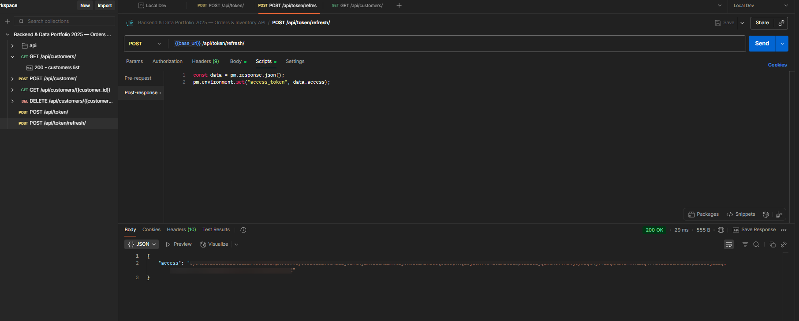

6. **Postman — 401 + auto-refresh funcionando (parte A)**  
   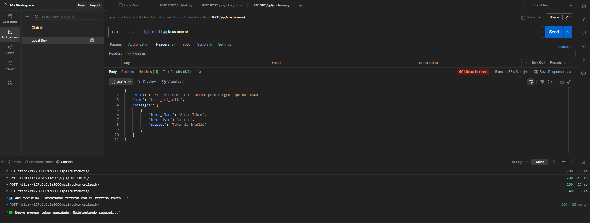

7. **Postman — 401 + auto-refresh funcionando (parte B, reintento OK)**  
   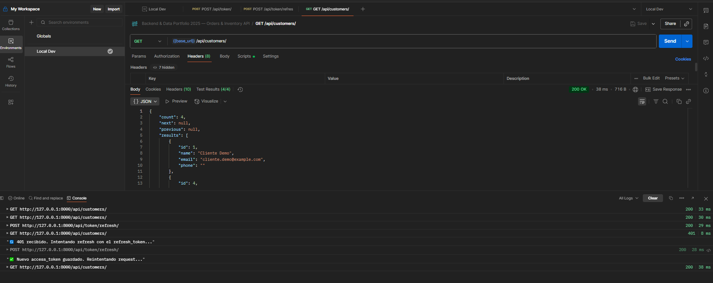

8. **Swagger — GET /api/customers/ sin auth (401)**  
   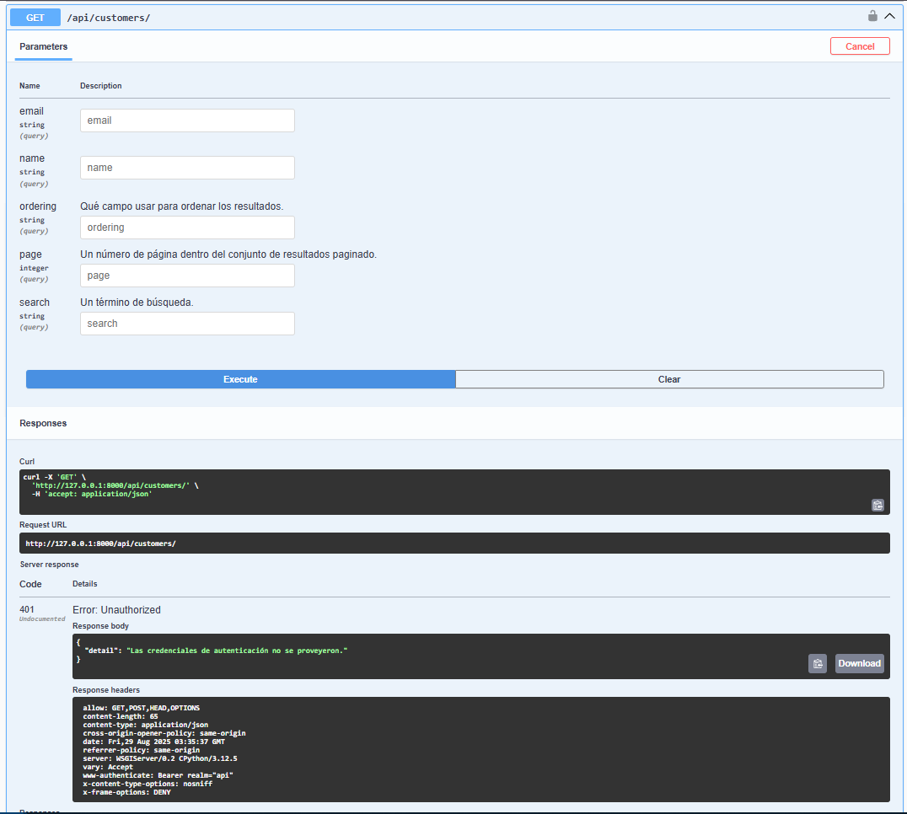

📸 Ver carpeta completa → [docs/capturas/semana2/dia3/](./capturas/semana2/dia3/)

---

### 📝 Notas
- Se validó que sin token Swagger devuelve **401 Unauthorized**.  
- Con token pegado en Authorize, Swagger ejecuta correctamente las requests.  
- En Postman, los scripts de colección permiten refrescar automáticamente el token:  
  - Si el access_token está vencido → se dispara un **POST /api/token/refresh/** con el refresh_token.  
  - Se guarda un nuevo access_token en `environment`.  
  - El request original se reintenta y devuelve **200 OK**.  

---

## 📅 Día 4 — Vie 29/08/2025  
**Tema:** Permisos por rol + afinación de filtros y paginación  

### 🔑 Objetivos
- Restringir acceso con **permisos por rol**:
  - `ProductViewSet` → solo lectura pública (auth requerida si intentan escribir).
  - `CustomerViewSet` y `OrderViewSet` → autenticación obligatoria.
- Implementar y validar **filtros de búsqueda y ordenación** en Swagger/Postman.
- Afinar **paginación personalizada** con `page` y `page_size`.

---

### ✅ Evidencia ### Capturas

1. **Swagger — paginación funcionando (parte A)**  
   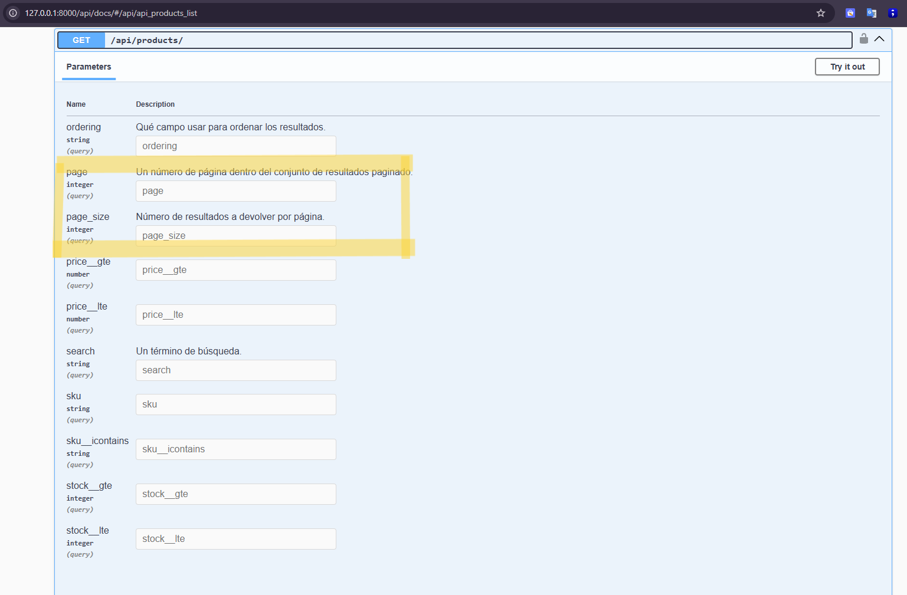

2. **Swagger — paginación funcionando (parte B)**  
   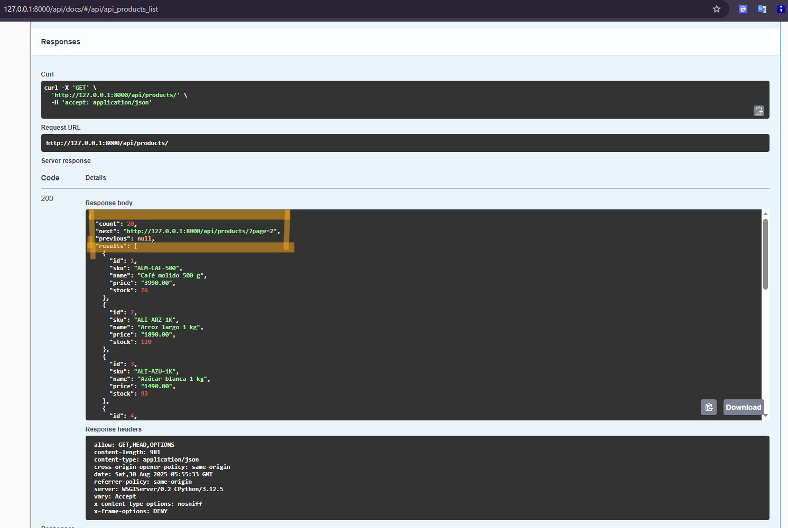

3. **Swagger — filtros ASC (parte A)**  
   -A.png)  

4. **Swagger — filtros ASC (parte B)**  
   -B.png)  

5. **Postman — customers sin token (401)**  
   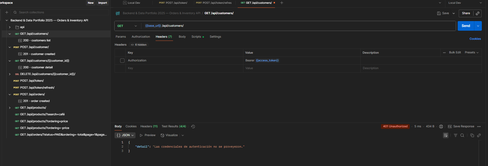

6. **Postman — customers autenticado (200)**  
   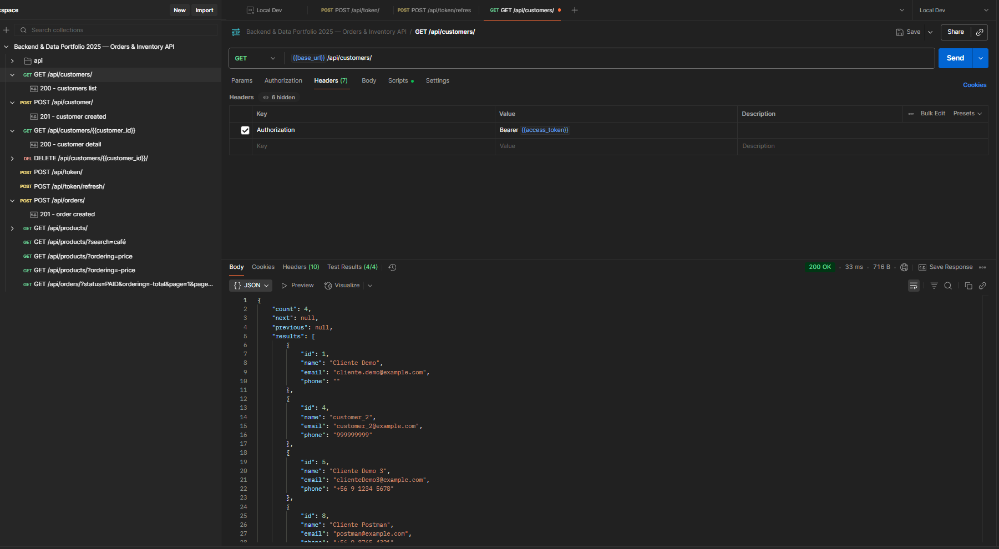

7. **Postman — filtros en orders**  
   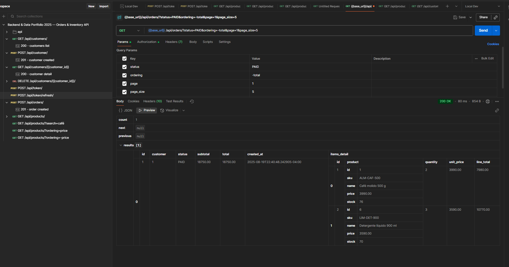

8. **DRF — ordering por precio ASC**  
   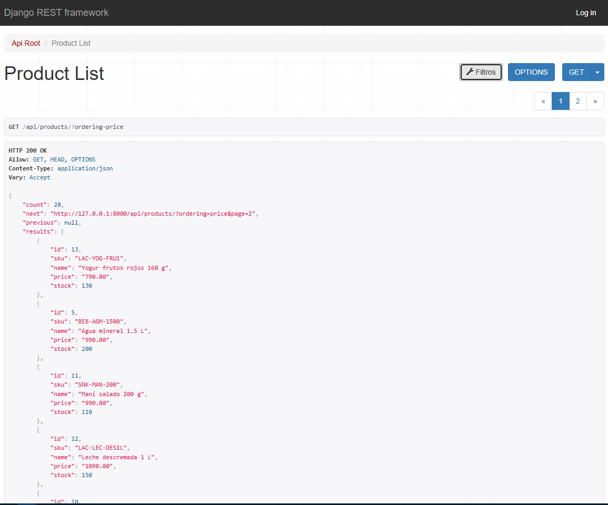

9. **DRF — ordering por precio DESC**  
   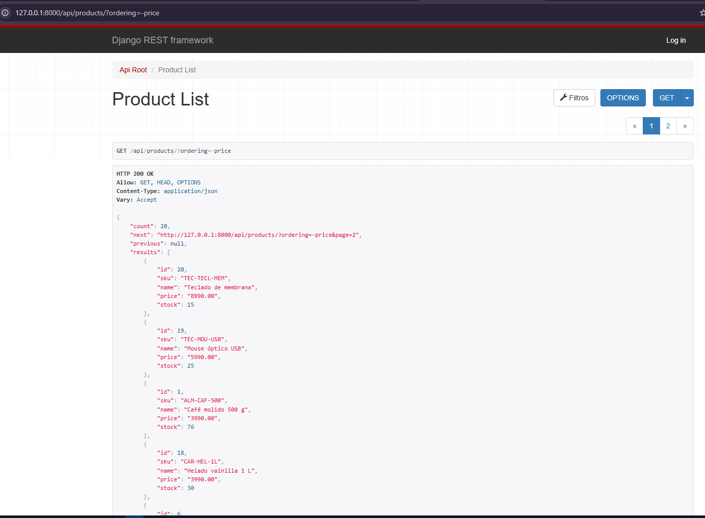

📸 Ver carpeta completa → [docs/capturas/semana2/dia4/](./capturas/semana2/dia4/)

---

### 📝 Notas
- Se añadió clase `IsRead_only` en `permissions.py` para productos → **lectura libre**, escritura requiere autenticación.
- `CustomerViewSet` y `OrderViewSet` quedaron protegidos con `IsAuthenticated`.
- Se configuró **`DefaultPagination`** con parámetros `page` y `page_size`.
- Probado en Swagger y Postman:
  - **401** sin token en endpoints protegidos.
  - **200 OK** con `Bearer {{access_token}}`.
  - Filtros (`search`, `ordering`) y paginación responden correctamente.

---

### ▶️ Próximos pasos
- Preparar **Semana 3**: enfoque en pruebas automáticas (`pytest`, `coverage`) y optimización con `select_related`/`prefetch_rela

