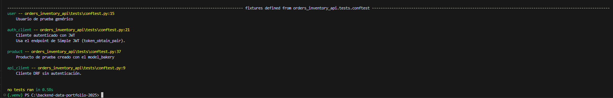
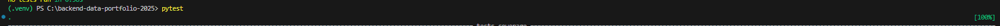
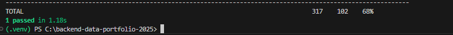

# Diario — Semana 3 _(08–12 sep 2025)_

> Ritmo: **4 mañanas/semana** (L–M backend, X–V datos)  
> Zona horaria: **America/Santiago**

---

## Estado general de la semana

- [x] **Día 1 (Lun 08/09):** Setup pytest + deps, fix deprecación CheckConstraint. — **completado**
- [ ] **Día 2 (Mar 09/09):** Fixtures + primer test Swagger.
- [ ] **Día 3 (Mié 10/09):** Tests Products (auth + paginación).
- [ ] **Día 4 (Vie 12/09):** Tests Orders (totales + stock).

---

## Día 1 — Lunes 08 sep 2025

### 🎯 Objetivo del día
- Instalar `pytest`, `pytest-django`, `pytest-cov`, `model-bakery`.
- Configurar `pytest.ini` en la raíz del proyecto.
- Corregir `CheckConstraint.check` → `.condition`.

### ✅ Lo conseguido
- Ejecución de `pytest -q` exitosa (sin errores, cobertura inicial 37%).
- Warning deprecado eliminado (`RemovedInDjango60Warning`).
- Commit `feat(S3D1): setup pytest config + deps`.
- Commit `fix(core): migrate CheckConstraint.check → .condition`.

### 🧪 Evidencia rápida
```powershell
pytest -q
# salida: collected 0 items
# coverage: 37%
```
📸 Ver carpeta completa → [docs/capturas/semana3/dia1/](./capturas/semana3/dia1/)
---
## 🧱 Bloqueos y soluciones

- Error inicial: ModuleNotFoundError: No module named 'core'.
- Solución: actualizar INSTALLED_APPS y apps.py a orders_inventory_api.core.

- Warning: CheckConstraint.check deprecado.
- Solución: reemplazo por condition=.

## ▶️ Próximos pasos (para el Día 2)

- Crear tests/conftest.py con fixtures (api_client, auth_client, product).

- Agregar primer test de Swagger (/api/docs).

- Commit esperado: test(S3D2): add base fixtures + swagger ui test.

--- 

## Día 2 — Martes 09 sep 2025

### 🎯 Objetivo del día
- Implementar `conftest.py` con fixtures reutilizables (api_client, user, auth_client, product).
- Escribir y ejecutar el primer test real: Swagger UI en `/api/docs`.

### ✅ Lo conseguido
- `conftest.py` creado en `orders_inventory_api/tests/`.
- Fixtures reconocidas por pytest (`pytest --fixtures` mostró `api_client`, `user`, `auth_client`, `product`).
- Primer test `test_docs.py` ejecutado en verde ✅.
- Cobertura aumentó a **68%**.

### 🧪 Evidencia rápida
```powershell
pytest -q
. [100%]
```
### 📸 Capturas guardadas
- **01-pytest-fixtures.png**  
  
- **02-swagger-test-pass.png**  
  
- **03-coverage-68.png**  
  

📸 Ver carpeta completa → [docs/capturas/semana3/dia2/](./capturas/semana3/dia2/)

---

### 🧱 Bloqueos y soluciones
- **Problema:** `ModuleNotFoundError: No module named 'config'`.  
  **Solución:** corregir imports en `urls.py` y `settings.py` → `orders_inventory_api.config.*`.  

- **Problema:** Paginación DRF referenciada como `config.pagination`.  
  **Solución:** corregido a `orders_inventory_api.config.pagination.DefaultPagination`.

---

### ▶️ Próximos pasos (para el Día 3)
Crear tests de `/api/products/`:
- Acceso público (**401/403**).  
- Acceso con auth (**200**, lista de productos).  
- Paginación (**count**, **results**, **next**, **previous**).