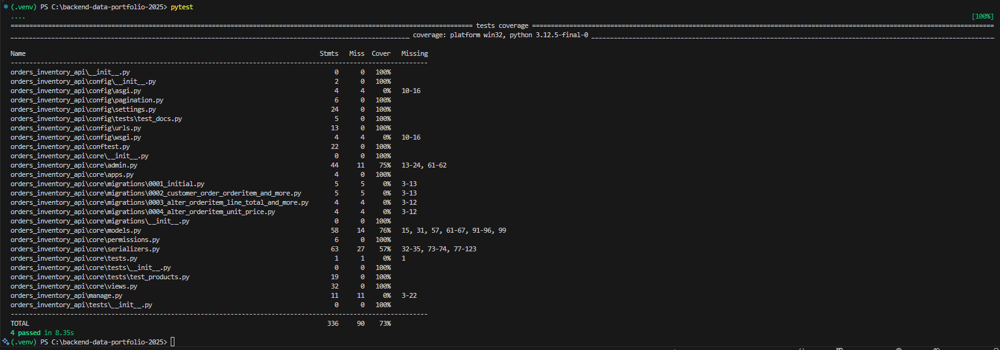
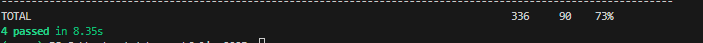
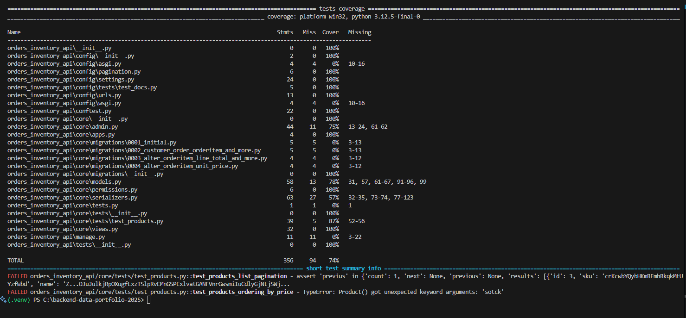
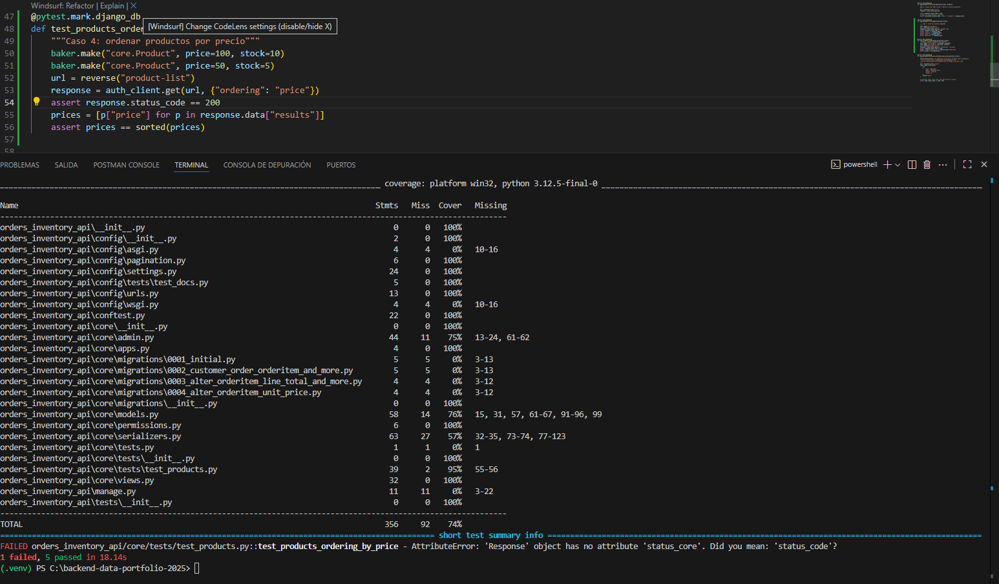
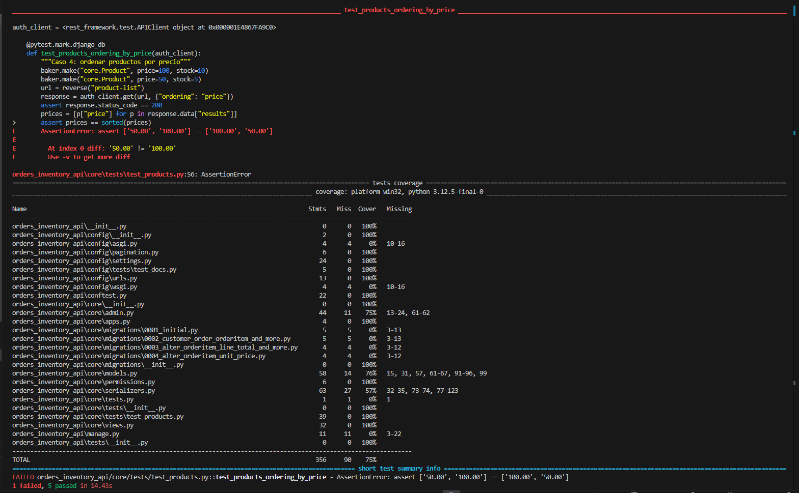
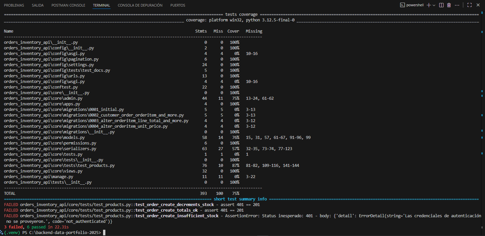
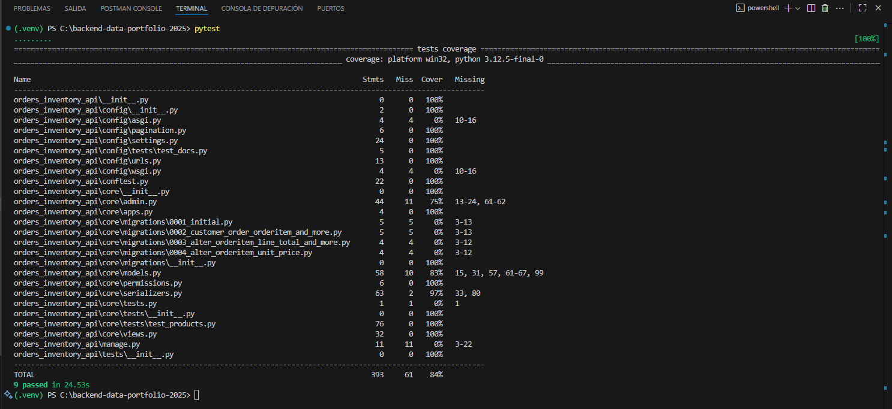

# Diario — Semana 3 _(08–12 sep 2025)_

> Ritmo: **4 mañanas/semana** (L–M backend, X–V datos)  
> Zona horaria: **America/Santiago**

---

## Estado general de la semana

- [x] **Día 1 (Lun 08/09):** Setup pytest + deps, fix deprecación CheckConstraint. — **completado**
- [x] **Día 2 (Mar 09/09):** Fixtures + primer test Swagger.                       — **completado**
- [x] **Día 3 (Mié 10/09):** Tests Products (auth + paginación).                   — **completado**
- [x] **Día 4 (Vie 12/09):** Tests Orders (totales + stock).                       — **completado**

---

## Día 1 — Lunes 08 sep 2025

### 🎯 Objetivo del día
- Instalar `pytest`, `pytest-django`, `pytest-cov`, `model-bakery`.
- Configurar `pytest.ini` en la raíz del proyecto.
- Corregir `CheckConstraint.check` → `.condition`.

### ✅ Lo conseguido
- Ejecución de `pytest -q` exitosa (sin errores, cobertura inicial 37%).
- Warning deprecado eliminado (`RemovedInDjango60Warning`).
- Commit `feat(S3D1): setup pytest config + deps`.
- Commit `fix(core): migrate CheckConstraint.check → .condition`.

### 🧪 Evidencia rápida
```powershell
pytest -q
# salida: collected 0 items
# coverage: 37%
```
📸 Ver carpeta completa → [docs/capturas/semana3/dia1/](./capturas/semana3/dia1/)
---
## 🧱 Bloqueos y soluciones

- Error inicial: ModuleNotFoundError: No module named 'core'.
- Solución: actualizar INSTALLED_APPS y apps.py a orders_inventory_api.core.

- Warning: CheckConstraint.check deprecado.
- Solución: reemplazo por condition=.

## ▶️ Próximos pasos (para el Día 2)

- Crear tests/conftest.py con fixtures (api_client, auth_client, product).

- Agregar primer test de Swagger (/api/docs).

- Commit esperado: test(S3D2): add base fixtures + swagger ui test.

--- 

## Día 2 — Martes 09 sep 2025

### 🎯 Objetivo del día
- Implementar `conftest.py` con fixtures reutilizables (api_client, user, auth_client, product).
- Escribir y ejecutar el primer test real: Swagger UI en `/api/docs`.

### ✅ Lo conseguido
- `conftest.py` creado en `orders_inventory_api/tests/`.
- Fixtures reconocidas por pytest (`pytest --fixtures` mostró `api_client`, `user`, `auth_client`, `product`).
- Primer test `test_docs.py` ejecutado en verde ✅.
- Cobertura aumentó a **68%**.

### 🧪 Evidencia rápida
```powershell
pytest -q
. [100%]
```
### 📸 Capturas guardadas
- **01-pytest-fixtures.png**  
  
- **02-swagger-test-pass.png**  
  
- **03-coverage-68.png**  
  

📸 Ver carpeta completa → [docs/capturas/semana3/dia2/](./capturas/semana3/dia2/)

---

### 🧱 Bloqueos y soluciones
- **Problema:** `ModuleNotFoundError: No module named 'config'`.  
  **Solución:** corregir imports en `urls.py` y `settings.py` → `orders_inventory_api.config.*`.  

- **Problema:** Paginación DRF referenciada como `config.pagination`.  
  **Solución:** corregido a `orders_inventory_api.config.pagination.DefaultPagination`.

---

### ▶️ Próximos pasos (para el Día 3)
Crear tests de `/api/products/`:
- Acceso público (**401/403**).  
- Acceso con auth (**200**, lista de productos).  
- Paginación (**count**, **results**, **next**, **previous**).

## Día 3 — Tests para Products + Ajustes de permisos DB

### ✅ Objetivos del día
- Configurar correctamente los permisos de usuario `app@%` en MariaDB para que Django pueda crear la base de datos de test.
- Implementar y ajustar pruebas de `ProductViewSet` en `core/tests/test_products.py`.
- Validar acceso público de lectura (GET) y bloqueo de escritura (POST).
- Confirmar que todos los tests pasen en verde y revisar cobertura.

### Plan de pruebas — Día 3 (Semana 3)

| Caso | Endpoint             | Setup                          | Acción                                        | Resultado esperado                                     |
|------|----------------------|--------------------------------|-----------------------------------------------|--------------------------------------------------------|
| 1    | `/api/products/`     | Ninguno                        | GET sin token                                 | 401 Unauthorized o 403 Forbidden                       |
| 2    | `/api/products/`     | Usuario autenticado            | GET con token válido                          | 200 OK + lista de productos                            |
| 3    | `/api/products/`     | Usuario + 15 productos creados | GET con token válido y `?page=1`              | 200 OK + campos `count`, `results`, `next`, `previous` | **pendiente para día 4**
| 4    | `/api/products/`     | Usuario + productos            | GET con token válido y `?ordering=unit_price` | 200 OK + productos ordenados por precio                | **pendiente para día 4**


### 📸 Evidencias

  
*Ejecución final de pytest con todos los tests aprobados.*

  
*Reporte de cobertura al cierre del día (73%).*

📸 Ver carpeta completa → [docs/capturas/semana3/dia2/](./capturas/semana3/dia3/)

### 📌 Notas
- Se confirmó que `ProductViewSet` funciona como `ReadOnlyModelViewSet`: lectura pública, escritura protegida.  
- Las pruebas fueron ajustadas para reflejar la política de permisos y la estructura paginada de DRF.  
- Cobertura general se mantiene en ~73%, próximos pasos: añadir más tests para `CustomerViewSet` y `OrderViewSet`.

## Día 4 (Vie 12/09) — Tests de Paginación, Ordenamiento y Orders

### Plan de pruebas — Día 4 (Semana 3)

| Caso | Endpoint         | Setup                          | Acción                                        | Resultado esperado                                     |
|------|------------------|--------------------------------|-----------------------------------------------|--------------------------------------------------------|
| 3    | `/api/products/` | Usuario + 15 productos creados | GET con token válido y `?page=1`              | 200 OK + campos `count`, `results`, `next`, `previous` |
| 4    | `/api/products/` | Usuario + productos            | GET con token válido y `?ordering=unit_price` | 200 OK + productos ordenados por precio                |
| 5    | `/api/orders/`   | Usuario + productos en stock   | POST crear pedido                             | 201 Created + subtotal y total correctos               |
| 6    | `/api/orders/`   | Usuario + productos en stock   | POST crear pedido                             | 201 Created + stock de productos decrementado          |
| 7    | `/api/orders/`   | Usuario + stock insuficiente   | POST crear pedido                             | 400/409/422 + no se crea orden ni se modifica stock    |

---

### 🐞 Evidencias de errores encontrados

- **Error Caso 3 (paginación)**  
  Se usó la clave `previus` en lugar de la correcta `previous`.  
  El test falló al no encontrar el campo esperado.  

  

- **Error Caso 4 (ordenamiento por precio)**  
  - Se escribió `sotck` en lugar de `stock`, provocando un `TypeError`.  
  - Luego, en otro intento se usó `status_core` en lugar de `status_code` y `"proce"` en vez de `"price"`.  
  - Finalmente, la comparación falló porque se estaban evaluando strings en vez de números (`["50.00", "100.00"]`).  

    
  

- **Errores Casos 5, 6 y 7 (órdenes)**  
  Todos los tests de creación de órdenes devolvían `401 Unauthorized`.  
  Causa: el fixture `auth_client` no configuraba correctamente el header `Authorization`.  
  Solución: corregir `api_client.credentials(HTTP_AUTHORIZATION="Bearer <token>")`.  

  

---

### 📸 Captura final

- **06-success-all-tests-passed.png**  
  

---

### ✅ Resumen

- Se completan los tests de **Products** (casos 1–4) y **Orders** (casos 5–7).  
- Se corrigió el fixture `auth_client` para manejar correctamente JWT.  
- Se documentaron errores encontrados y su solución.  
- Se agregaron capturas del Día 4, incluida la evidencia final (**9 passed**).

---

# 📌 Cierre — Semana 3

### Objetivos alcanzados
- Implementación de **tests automáticos** para el módulo de Products:
  - Acceso público (lectura).
  - Acceso autenticado (JWT).
  - Paginación y ordenamiento.
  - Restricción de escritura (solo lectura).
- Implementación de **tests automáticos** para el módulo de Orders:
  - Creación de órdenes con totales correctos.
  - Decremento automático de stock.
  - Validación de stock insuficiente.
- Corrección del fixture `auth_client` en `conftest.py` para autenticar correctamente con **JWT**.
- Documentación detallada de todos los errores encontrados durante las pruebas y sus soluciones.
- Capturas de evidencia de fallos y de la ejecución final exitosa (**9 tests passed**).

### Estado final
- **Coverage tests semana 3:** 75%  
- **Todos los tests pasados satisfactoriamente.**

### Próximos pasos (Semana 4)
- Implementar **tareas asíncronas** (Celery + Redis).
- Exportación de reportes en **CSV**.
- Envío de reportes por **correo electrónico**.
- Continuar con la documentación en `diario-semana4.md`.

---
