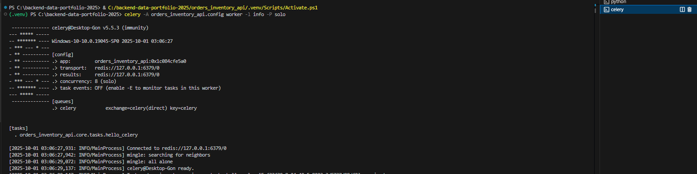
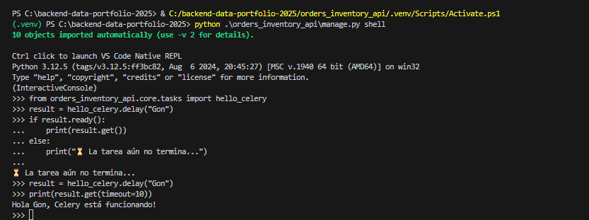

# Diario — Semana 4 _(30 sep – 03 oct 2025)_

> Ritmo: **4 mañanas/semana** (L–M backend, X–V datos)  
> Zona horaria: **America/Santiago**

---

## Estado general de la semana

- [x] **Día 1 (Lun 30/09):** Setup Celery + Redis, primera tarea `hello_celery`.  — **completado**
- [ ] **Día 2 (Mar 01/10):** Endpoint `/api/tasks/hello/` + consulta de estado.
- [ ] **Día 3 (Mié 02/10):** Exportación CSV con Celery Task.
- [ ] **Día 4 (Vie 03/10):** Envío de reportes por correo (Email + Celery).

---

## Día 1 — Lunes 30 sep 2025

### 🎯 Objetivo del día
- Instalar y configurar **Celery** con **Redis** como broker/result backend.
- Crear archivo `celery.py` en `orders_inventory_api/config/`.
- Definir primera tarea de prueba `hello_celery` en `orders_inventory_api/core/tasks.py`.
- Verificar ejecución de worker y comunicación con Django.

### ✅ Lo conseguido
- Worker de Celery iniciado correctamente con:
```powershell
celery -A orders_inventory_api.config worker -l info -P solo
```
- `hello_celery` registrada en el worker.
- Prueba desde `manage.py shell` confirmando ejecución de la tarea:
```python
      from orders_inventory_api.core.tasks import hello_celery
      result = hello_celery.delay("Gon")
      if result.ready():
        print(result.get())
```
**Salida esperada:**
```
Hola Gon, Celery está funcionando!
```

### 🧪 Evidencia rápida

### 📸 Capturas guardadas
- **01-celery-worker-start.png**  
  
- **02-celery-shell-test.png**  
  

📸 Ver carpeta completa → [docs/capturas/semana4/dia1/](./capturas/semana4/dia1/)

---

### 🧱 Bloqueos y soluciones

- **Problema:** `ModuleNotFoundError` al invocar `celery -A config worker -l info`.  
  **Solución:** ejecutar desde la raíz del proyecto con el path correcto:  
  ```powershell
  celery -A orders_inventory_api.config worker -l info
  ```

- **Problema:** Worker colgado en Windows con `prefork`.  
  **Solución:** usar `-P solo` para modo compatible en Windows.  

---

### ▶️ Próximos pasos (para el Día 2)

- Crear endpoint `/api/tasks/hello/` que dispare la tarea y devuelva el `task_id`.  
- Agregar un segundo endpoint `/api/tasks/status/<task_id>/` para consultar estado/resultados.  
- Documentar pruebas con Postman.  
